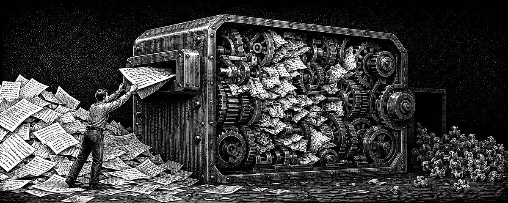
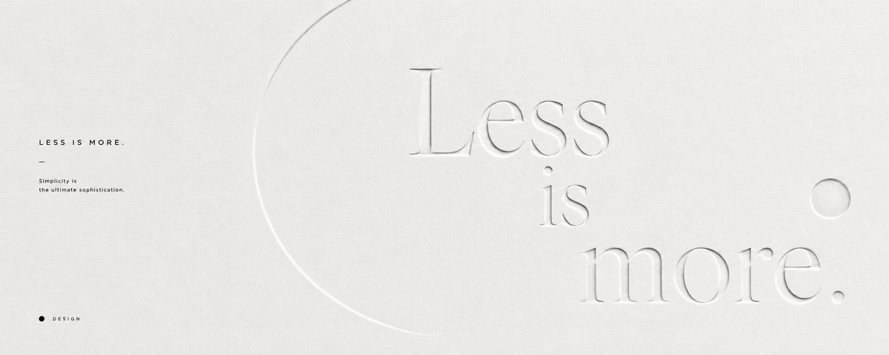
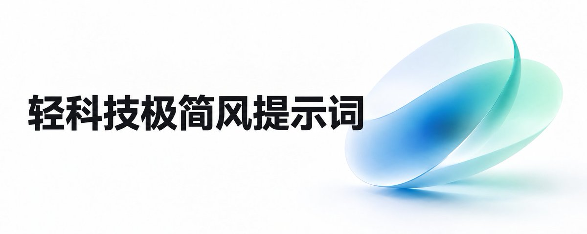

# Punk Skill

[中文](./README.md)

Punk Skill is a collection of visual-generation Skills for AI agents. After installation, it can turn articles into cover images, or turn photos of people, pets, and objects into avatar images.

> [!IMPORTANT]
> Punk Skill `v2.0.0` and later releases are publicly available, with free personal non-commercial use. Any use by a company, institution, studio, team, employee, contractor, or client project, as well as use for paid services, commercial content, marketing, advertising, brand communications, product integrations, commercial workflows, or other commercial purposes, requires prior written commercial authorization and payment of the applicable license fee. See [Licensing](#license).

## Installation

Send the following message to an AI agent that supports Skills:

```text
Please install all Skills from this repository: https://github.com/adrianpunk/Punk-Skill
```

Then invoke them like this:

```text
Use $punk-cover ...
Use $punk-avatar ...
```

## Available Skills

| Skill | Purpose |
| --- | --- |
| `punk-cover` | Create covers for Xiaohongshu, WeChat public accounts, X, and global social platforms. |
| `punk-avatar` | Create avatars for people, pets, and objects, plus pet keepsake cards and surreal paper-art portraits. |

## punk-cover

`punk-cover` turns articles, notes, posts, and topic drafts into a single cover image. It supports Chinese platforms as well as X, Instagram, Facebook, LinkedIn, YouTube, TikTok, Pinterest, Snapchat, Reddit, Threads, Bluesky, Medium, and other cover use cases.

### Languages, global platforms, and aspect ratios

`punk-cover` detects the host system language and automatically uses Chinese or English mode. Chinese locales receive Chinese platform and style choices; other locales receive English choices. You can explicitly request `中文`, `English`, or `中英双语`. The language mode controls interface copy, prompts, title/subtitle treatment, and supporting text. User-provided titles and proper nouns remain unchanged by default.

The available platform choices include Xiaohongshu, WeChat public accounts, X, Instagram, Facebook, LinkedIn, YouTube, TikTok, Pinterest, Snapchat, Reddit, Threads, Bluesky, and Medium. See the complete mapping in [`platform-catalog.md`](./skills/punk-cover/references/platform-catalog.md).

The current image-generation tool supports only `1:1`, `2:3`, `3:2`, `4:3`, `3:4`, `9:16`, `16:9`, and `21:9`. When a platform or custom requested ratio is unsupported, the Skill clearly states that only the closest ratio can be generated and uses the closest supported ratio automatically. X `5:2` and WeChat public account `2.35:1` both use `21:9`. This describes an image-tool limitation and does not claim compliance with any platform's cover-size standard.

### Usage examples

Article-only input:

```text
Use $punk-cover to create a cover image for this article:

Paste the article, note, or topic draft here.
```

Specify a platform and style:

```text
Use $punk-cover to create a WeChat public account cover in Business Magazine Front Page style:

Paste the article here.
```

Use English mode explicitly:

```text
Use $punk-cover in English mode to create an Instagram Reels cover in Minimal Light Tech style:

How AI agents are changing creative work
```

Specify a custom ratio:

```text
Use $punk-cover to create a cover image, aspect ratio 16:9, style Black-and-White Minimal Concept:

AI agents are changing how content is produced.
```

Prompt-only output:

```text
Use $punk-cover to create prompt-only output for this X cover, style Black-and-White-and-Gray Avant-Garde Geometry:

Paste the post or article summary here.
```

### Available styles

Style IDs remain the same in both language modes. Localized names and use-case descriptions are maintained in [`style-catalog.md`](./skills/punk-cover/references/style-catalog.md).

| Style | Style ID | Best for |
| --- | --- | --- |
| Black-and-White Minimal Concept | `black-white-minimal-concept` | Abstract, editorial, philosophical, strategic, restrained covers with strong typography and visual metaphor |
| Black-and-White Vintage Etching Editorial Cover | `black-white-etching-editorial-cover` | Monochrome engraving, etching, antique scientific illustration, surreal editorial, and philosophical themes |
| Semantic Minimal Translation | `semantic-minimal-translation` | A word, short phrase, slogan, or concept needing a minimal visual translation |
| Retro Torn-Paper Collage | `retro-torn-collage` | Social posts, cultural topics, controversy, growth, street energy, and retro editorial themes |
| Block World | `block-world` | Tutorials, tools, systems, upgrades, learning, and game-like themes |
| Giant Perspective Chinese Title | `giant-perspective-chinese-title` | Chinese title-led covers with strong impact, spatial depth, speed, conflict, or event-poster energy |
| Interleaved Oversized Title Editorial Poster | `interleaved-title-editorial-poster` | A single subject, oversized short title, foreground/background text interleaving, and modern editorial poster energy |
| Layered Paper-Cut Concept Poster | `layered-paper-cut-concept-poster` | Relationships, tensions, transformations, and precise spatial metaphors in layered paper |
| Embossed/Debossed Paper Cover | `paper-emboss-deboss-cover` | Art books, independent magazines, paper relief, editorial typography, and restrained metaphors |
| Godot 2D Pixel Metaphor Poster | `godot-2d-pixel-metaphor-poster` | Abstract themes expressed as one game mechanic, character action, goal, or obstacle in a pixel world |
| OSB Industrial Blue Line Metaphor | `osb-industrial-blue-line-metaphor` | Work, organization, efficiency, tools, relationships, paths, and reconnection metaphors |
| Brick World | `brick-world` | Building, teamwork, planning, education, family, and systems metaphors |
| Consulting Report Visual | `consulting-report-visual` | Business strategy, methodology, operations, product thinking, consulting, and structured analysis |
| Research Journal Concept | `research-journal-concept` | Science, medicine, materials, biology, mechanisms, and lab themes |
| Retro Diffuse Gradient | `retro-diffuse-gradient` | Art, design, music, brands, emotions, and independent magazine themes |
| Mid-Century Surreal Editorial Cover | `midcentury-surreal-editorial-cover` | AI, coding, digital work, future tools, and restrained era-displacement metaphors |
| Minimal Public-Space Photography | `minimal-public-space-photography` | Opinion essays, cultural observation, spatial order, and individual-space metaphors |
| Business Magazine Front Page | `business-magazine-front-page` | Business, technology, AI, startups, investment, and trend analysis |
| Black-and-White-and-Gray Avant-Garde Geometry | `black-white-gray-avant-geometry` | Experimental, modernist, geometric, and high-contrast themes |
| Black-and-Red Silhouette | `black-red-silhouette` | Tool tutorials, AI workflows, finance, speed, cinema, and direct metaphors |
| Avant-Retro Architecture Poster | `avant-retro-architecture-poster` | Architecture, landmarks, cities, travel, exhibitions, and spatial culture |
| Retro Ink Dot-Matrix Metaphor | `retro-ink-dot-matrix-metaphor` | AI, technology, systems, research, and abstract ideas with a retro print metaphor |
| Black Mid-Century Modernist Cover | `black-midcentury-modernist-cover` | Premium retro scenes, products, people, architecture, and concepts |
| Silver Foil Blue Minimal | `silver-foil-blue-minimal` | Growth paths, methods, business systems, AI tools, and abstract ideas |
| Color Neo-Constructivist Megastructure Poster | `color-neo-constructivist-megastructure-poster` | Events, sports, product launches, cities, technology, and high-impact social covers |
| Retro Japanese Sci-Fi Anime Cover | `retro-japanese-sci-fi-anime-cover` | AI, technology, systems, psychology, social conflict, and methodology |
| French Minimal Ink Poster | `french-minimal-ink-poster` | Quiet editorial essays, AI, technology, relationships, social systems, and abstract ideas |
| Brand Collaboration Connection | `brand-collaboration-connection` | Brand partnerships, tool integrations, workflow automation, product tutorials, and enterprise connections |
| Anthropic Research Style | `anthropic-research-style` | AI, research, knowledge, systems, and design topics needing a quiet editorial cover |
| Kimi Style | `kimi-stlye` | AI, research, products, materials, systems, and creative projects needing an archival tabletop view |
| Minimal Light Tech | `minimal-light-tech` | Light-tech, tools, products, and tutorials with clean white space and a gradient anchor |
| Minimal Visual Metaphor | `minimal-visual-metaphor` | Business technology, AI, products, organizations, workflows, and system change |

### Style examples

| | | |
|:---:|:---:|:---:|
|  |  |  |
| Black-and-White Minimal Concept | Semantic Minimal Translation | Retro Torn-Paper Collage |
|  | | |
| Black-and-White Vintage Etching Editorial Cover | | |
|  |  |  |
| Block World | Giant Perspective Chinese Title | Brick World |
|  |  |  |
| Interleaved Oversized Title Editorial Poster | Layered Paper-Cut Concept Poster | Mid-Century Surreal Editorial Cover |
|  |  |  |
| Embossed/Debossed Paper Cover | Godot 2D Pixel Metaphor Poster | OSB Industrial Blue Line Metaphor |
|  |  |  |
| Consulting Report Visual | Research Journal Concept | Retro Diffuse Gradient |
|  |  |  |
| Minimal Public-Space Photography | Business Magazine Front Page | Black-and-White-and-Gray Avant-Garde Geometry |
|  |  |  |
| Black-and-Red Silhouette | Avant-Retro Architecture Poster | Retro Ink Dot-Matrix Metaphor |
|  |  |  |
| Black Mid-Century Modernist Cover | Silver Foil Blue Minimal | Color Neo-Constructivist Megastructure Poster |
|  |  |  |
| Retro Japanese Sci-Fi Anime Cover | French Minimal Ink Poster | Brand Collaboration Connection |
|  |  |  |
| Anthropic Research Style | Kimi Style | Minimal Visual Metaphor |
|  | | |
| Minimal Light Tech | | |

## punk-avatar

`punk-avatar` turns photos or text descriptions of people, pets, and objects into avatar images. It also supports pet keepsake cards and surreal paper-art scenes where a real person emerges from a flat landscape.

### Usage examples

Create an avatar from a photo:

```text
Use $punk-avatar to create an avatar from this photo.
```

Specify an avatar style:

```text
Use $punk-avatar to create a Pixel Avatar from this photo.
```

Create a pet keepsake card:

```text
Use $punk-avatar to create a Polaroid Keepsake Card for this pet. Pet name: Cola.
```

Specify a custom ratio:

```text
Use $punk-avatar to create a Messy Crayon Pet Portrait, aspect ratio 4:5. Pet name: Milk Tea.
```

Text-only avatar description:

```text
Use $punk-avatar to create a text-only Pixel Avatar: a calm robot barista with a blue cap and square glasses.
```

Paper-acrylic block illustration:

```text
Use $punk-avatar to create a Minimal Paper Acrylic Block Illustration from this photo or theme:

A person walking toward a staircase leading to the sky.
```

Surreal pop-up paper landscape, before/after comparison:

```text
Use $punk-avatar to create a Surreal Pop-Up Paper Landscape before/after comparison from this photo.
```

Surreal pop-up paper landscape, single result:

```text
Use $punk-avatar to create a Surreal Pop-Up Paper Landscape single-result image from this photo.
```

### Available styles

| Style | Style ID | Subject | Best for |
| --- | --- | --- | --- |
| Pixel Avatar | `pixel-avatar` | People, pets, objects | Standard avatars, pixel IP, and symbolic avatars |
| Grotesque Soul Sketch | `grotesque-soul-sketch` | People, pets | Playful and expressive hand-drawn portraits |
| Messy Crayon Pet Portrait | `messy-crayon-pet-portrait` | Pets | Pet avatars and hand-drawn pet portraits |
| Fashion Sketch Observation Page | `fashion-sketch-observation` | People | Portraits with street-style and travel-observation energy |
| Polaroid Keepsake | `polaroid-keepsake` | Pets | Pet-derived cards and keepsake images |
| Minimal Paper Acrylic Block Illustration | `minimal-paper-acrylic-block-illustration` | People, pets, objects, scenes, themes | Rough white paper, vivid acrylic blocks, and generous negative space |
| Surreal Pop-Up Paper Landscape | `surreal-pop-up-paper-landscape` | People, scenes | A dimensional person with the original environment folded backward into a flattened paper landscape; supports before/after and single-result modes |

### Style examples

| | | |
|:---:|:---:|:---:|
|  |  |  |
| Pixel Avatar | Grotesque Soul Sketch | Messy Crayon Pet Portrait |
|  |  | |
| Fashion Sketch Observation Page | Polaroid Keepsake | |
|  |  | |
| Minimal Paper Acrylic Block Illustration | Surreal Pop-Up Paper Landscape | |

## License

Punk Skill `v2.0.0` and later releases use a dual-track license:

- Personal non-commercial use is free under the [Punk Skill Personal Use License 1.0](./LICENSE-PERSONAL.md).
- Commercial use requires prior written commercial authorization from the rights holder and payment of the applicable license fee. See [Commercial Licensing](./COMMERCIAL-LICENSE.md); contact `adrian.pduck@gmail.com`.

Use by companies, institutions, studios, teams, employees, contractors, or client projects, as well as paid services, commercial content, marketing, advertising, brand communications, product or workflow integrations, is commercial use. Internal use, trials, not-yet-profitable use, or use without a separate client charge does not by itself make the use personal non-commercial use.

Versions previously released under the MIT License remain subject to their original MIT License. This change does not retroactively revoke existing permissions. See [LICENSE-MIT-LEGACY](./LICENSE-MIT-LEGACY).

Third-party materials are not relicensed by this repository's license statements. See [THIRD_PARTY_NOTICES.md](./THIRD_PARTY_NOTICES.md).

## Acknowledgements

- Prompt design and visual direction: [@adrianpunk](https://github.com/adrianpunk) · [X](https://x.com/AdrianPunk115)
- Repository maintenance: [@jinchenma94](https://github.com/jinchenma94) · [X](https://x.com/jinchenma_ai)
