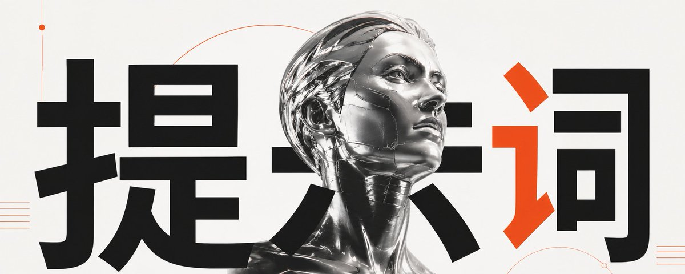
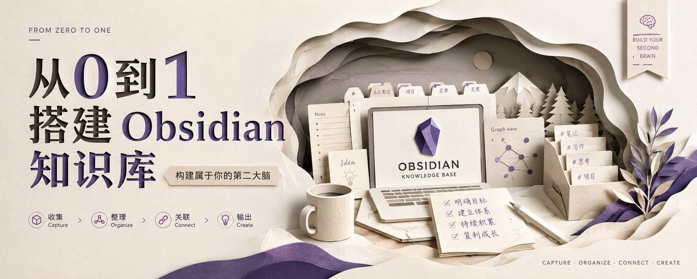
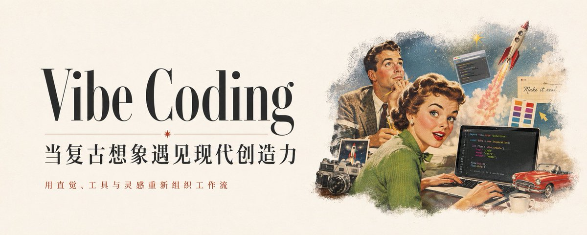
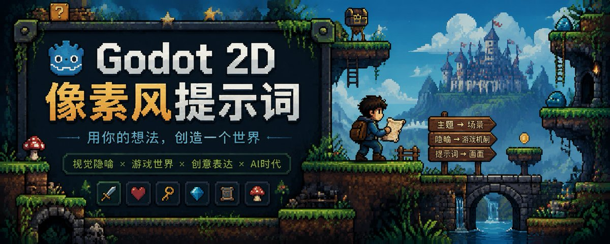
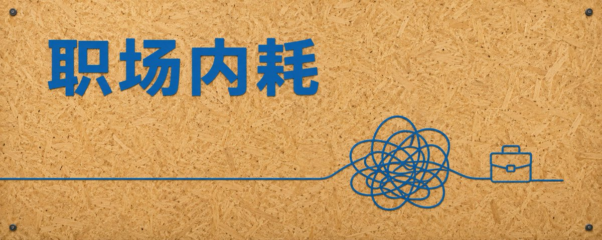
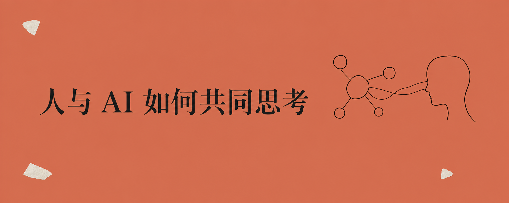
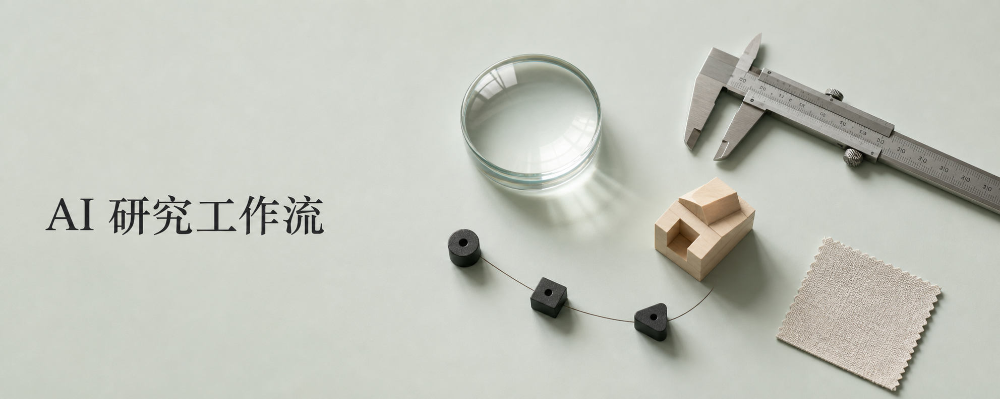
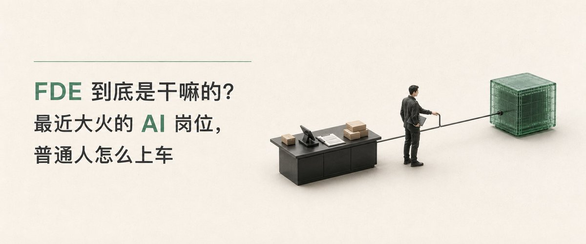
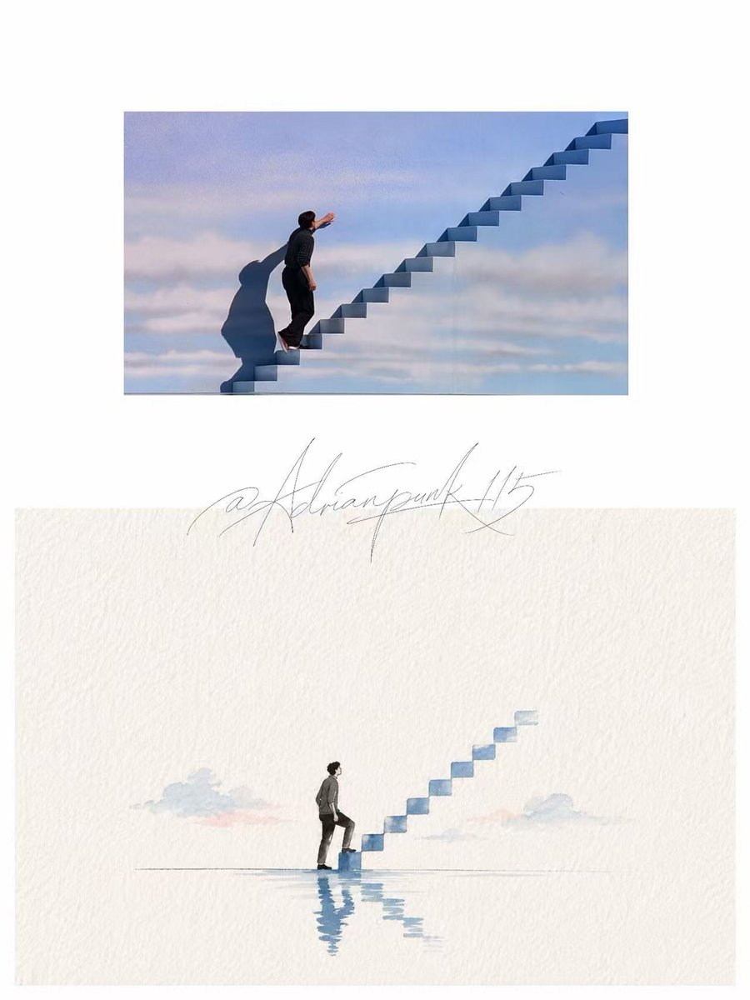
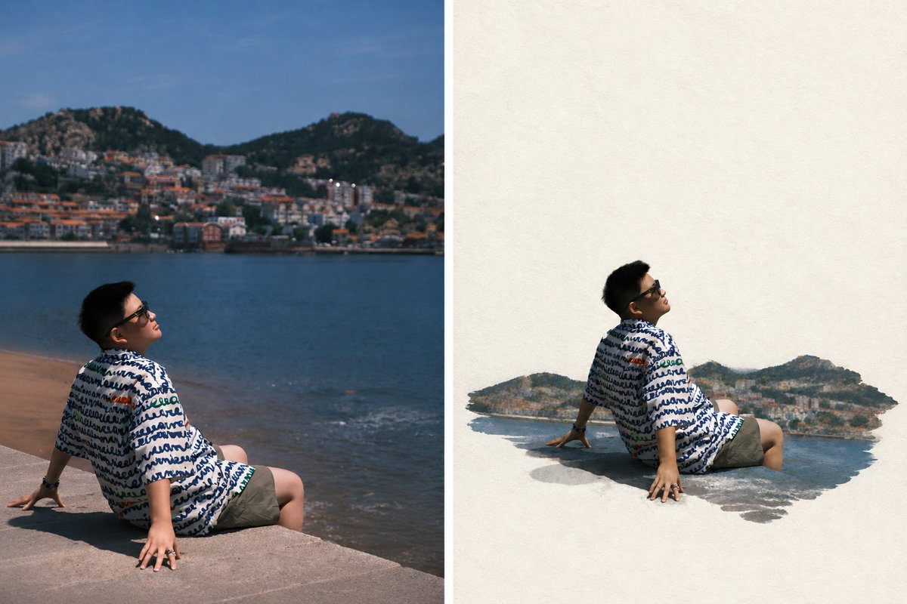

# Punk Skill

Punk Skill 是一组给 AI Agent 使用的视觉生成 Skills。安装后，可以用它把文章生成封面图，或把人物、宠物、物品照片生成头像图。

## 安装

把下面这段话发给支持 Skills 的 AI Agent：

```text
请安装这个仓库里的全部 Skills：https://github.com/adrianpunk/Punk-Skill
```

安装后可以这样调用：

```text
Use $punk-cover ...
Use $punk-avatar ...
```

## 可用 Skills

| Skill | 用途 |
| --- | --- |
| `punk-cover` | 生成小红书、微信公众号、X / Twitter 等平台的封面图 |
| `punk-avatar` | 生成人物头像、宠物头像、物品头像、宠物纪念卡和超现实人物纸艺图 |

## punk-cover

`punk-cover` 用来把文章、笔记、推文、主题草稿生成一张封面图。适合小红书、微信公众号、X / Twitter，以及其他需要封面视觉的内容。

### 使用示例

只给文章内容：

```text
Use $punk-cover to create a cover image for this article:

这里粘贴文章、笔记或主题草稿
```

指定平台和风格：

```text
Use $punk-cover to create a WeChat public account cover in 商业杂志头版 style:

这里粘贴文章内容
```

指定自定义比例：

```text
Use $punk-cover to create a cover image, aspect ratio 16:9, style 黑白极简概念:

AI Agent 正在改变内容生产方式
```

只生成提示词，不生成图片：

```text
Use $punk-cover to create prompt-only output for this X cover, style 黑白灰先锋几何:

这里粘贴推文或文章摘要
```

### 可用风格

| 风格 | Style ID | 适合内容 |
| --- | --- | --- |
| 黑白极简概念 | `black-white-minimal-concept` | 抽象观点、战略、哲学、批判性主题 |
| 语义转译极简 | `semantic-minimal-translation` | 单词、短句、口号、概念转译 |
| 复古手撕拼贴 | `retro-torn-collage` | 社交传播、文化议题、街头感、复古杂志感 |
| 方块世界 | `block-world` | 教程、工具、系统搭建、升级、游戏化表达 |
| 巨型透视中文标题 | `giant-perspective-chinese-title` | 中文标题主导、强冲击、活动和社媒封面 |
| 超大标题图文穿插 | `interleaved-title-editorial-poster` | 单一中景主体、超大短标题、前后景图文穿插和强编辑海报感 |
| 立体纸雕概念海报 | `layered-paper-cut-concept-poster` | 真实立体纸层、单一准确隐喻、极简留白、柔和光影和多比例独立重构 |
| Godot 2D 像素隐喻海报 | `godot-2d-pixel-metaphor-poster` | 把抽象主题转成单一游戏机制、角色动作、目标或阻碍与完整像素关卡世界 |
| OSB 工业蓝线条隐喻 | `osb-industrial-blue-line-metaphor` | 满版真实 OSB 木板、左上工业蓝标识字、右下单线隐喻和严格留白控制 |
| 积木世界 | `brick-world` | 搭建、团队、计划、教育、亲子和系统隐喻 |
| 咨询报告视觉 | `consulting-report-visual` | 商业策略、方法论、产品分析、结构化观点 |
| 科研期刊概念 | `research-journal-concept` | 科研、医学、材料、生物、机制类主题 |
| 复古弥散渐变 | `retro-diffuse-gradient` | 艺术、设计、品牌、情绪化文章和杂志封面 |
| 复古时代错位编辑封面 | `midcentury-surreal-editorial-cover` | AI、Coding、数字工作、未来工具和需要复古时代错位隐喻的当代主题 |
| 极简公共空间摄影 | `minimal-public-space-photography` | 观点长文、文化观察、空间秩序和个体隐喻 |
| 商业杂志头版 | `business-magazine-front-page` | AI、创业、投资、趋势、商业科技封面 |
| 黑白灰先锋几何 | `black-white-gray-avant-geometry` | 实验性、现代主义、几何构成、强对比视觉 |
| 黑红剪影 | `black-red-silhouette` | 工具教程、AI 工作流、金融、速度、电影和直接隐喻封面 |
| 先锋复古建筑海报 | `avant-retro-architecture-poster` | 建筑地标、城市海报、旅行封面、展览活动和空间文化内容 |
| 复古油墨点阵隐喻 | `retro-ink-dot-matrix-metaphor` | AI、科技、系统、研究和抽象观点的复古点阵隐喻封面 |
| 黑色复古现代主义封面 | `black-midcentury-modernist-cover` | 复古高级、服务场景、产品人物、建筑和概念封面 |
| 银色锡纸蓝字 | `silver-foil-blue-minimal` | 成长路径、方法论、商业系统、AI 工具和抽象观点的高级极简封面 |
| 彩色新构成主义巨构海报 | `color-neo-constructivist-megastructure-poster` | 热点事件、体育赛事、产品发布、城市建筑和强冲击社媒封面 |
| 复古日本科幻动画 | `retro-japanese-sci-fi-anime-cover` | AI、系统、代码、心理、社会冲突和方法论的复古科幻动画封面 |
| 法式极简墨线海报 | `french-minimal-ink-poster` | AI、关系、制度、选择和抽象观点的手绘墨线隐喻封面 |
| 品牌协同连接 | `brand-collaboration-connection` | 品牌联动、工具集成、自动化工作流、产品教程和企业级连接封面 |
| Anthropic Research 风格 | `anthropic-research-style` | AI、研究、知识、系统和设计主题的极简编辑封面 |
| kimi风格 | `kimi-stlye` | AI、研究、产品、材料和创意项目的俯视档案桌封面 |
| 极简视觉隐喻风 | `minimal-visual-metaphor` | AI、商业科技、产品、组织和系统变化的极简实体隐喻封面 |

### 风格样例

| | | |
|:---:|:---:|:---:|
|  |  |  |
| 黑白极简概念 | 语义转译极简 | 复古手撕拼贴 |
|  |  |  |
| 方块世界 | 巨型透视中文标题 | 积木世界 |
|  |  |  |
| 超大标题图文穿插 | 立体纸雕概念海报 | 复古时代错位编辑封面 |
|  |  | |
| Godot 2D 像素隐喻海报 | OSB 工业蓝线条隐喻 | |
|  |  |  |
| 咨询报告视觉 | 科研期刊概念 | 复古弥散渐变 |
|  |  |  |
| 极简公共空间摄影 | 商业杂志头版 | 黑白灰先锋几何 |
|  |  |  |
| 黑红剪影 | 先锋复古建筑海报 | 复古油墨点阵隐喻 |
|  |  |  |
| 黑色复古现代主义封面 | 银色锡纸蓝字 | 彩色新构成主义巨构海报 |
|  |  |  |
| 复古日本科幻动画 | 法式极简墨线海报 | 品牌协同连接 |
|  |  |  |
| Anthropic Research 风格 | kimi风格 | 极简视觉隐喻风 |

## punk-avatar

`punk-avatar` 用来把人物、宠物、物品照片或文字描述生成头像图，也可以生成宠物纪念卡，以及让真实人物从扁平景色中跃出的超现实纸艺作品。

### 使用示例

用照片生成头像：

```text
Use $punk-avatar to create an avatar from this photo.
```

指定头像风格：

```text
Use $punk-avatar to create a 像素头像 from this photo.
```

给宠物生成拍立得纪念卡：

```text
Use $punk-avatar to create a 拍立得纪念卡 for this pet. 宠物名：可乐。
```

指定自定义比例：

```text
Use $punk-avatar to create a 凌乱蜡笔宠物肖像, aspect ratio 4:5. 宠物名：奶茶。
```

纯文字描述头像：

```text
Use $punk-avatar to create a text-only 像素头像: a calm robot barista with a blue cap and square glasses.
```

纸感丙烯色块插画：

```text
Use $punk-avatar to create a 极简纸感丙烯色块插画 from this photo or theme:
一个人走向一架通往天空的楼梯
```

立体人物扁平景色纸艺（前后对比图）：

```text
Use $punk-avatar to create a 立体人物扁平景色纸艺 前后对比图 from this photo.
```

立体人物扁平景色纸艺（单张效果图）：

```text
Use $punk-avatar to create a 立体人物扁平景色纸艺 单张效果图 from this photo.
```

### 可用风格

| 风格 | Style ID | 对象 | 适合内容 |
| --- | --- | --- | --- |
| 像素头像 | `pixel-avatar` | 人、宠物、物品 | 标准头像、像素 IP、符号化头像 |
| 怪诞灵魂手绘 | `grotesque-soul-sketch` | 人、宠物 | 趣味头像、情绪化手绘肖像 |
| 凌乱蜡笔宠物肖像 | `messy-crayon-pet-portrait` | 宠物 | 宠物头像、宠物手绘肖像 |
| 时尚速写观察页 | `fashion-sketch-observation` | 人 | 人像头像、街拍和旅行观察页感肖像 |
| 拍立得纪念卡 | `polaroid-keepsake` | 宠物 | 宠物头像衍生卡片、宠物纪念图 |
| 极简纸感丙烯色块插画 | `minimal-paper-acrylic-block-illustration` | 人、宠物、物品、场景、主题 | 小主体、粗糙白纸、鲜明丙烯色块和大面积留白的纸感手绘插画 |
| 立体人物扁平景色纸艺 | `surreal-pop-up-paper-landscape` | 人、场景 | 真人保持立体，原照片环境向后翻倒并压扁为纸面景色；支持前后对比图与单张效果图 |

### 风格样例

| | | |
|:---:|:---:|:---:|
|  |  |  |
| 像素头像 | 怪诞灵魂手绘 | 凌乱蜡笔宠物肖像 |
|  |  | |
| 时尚速写观察页 | 拍立得纪念卡 | |
|  |  | |
| 极简纸感丙烯色块插画 | 立体人物扁平景色纸艺 | |

## 致谢

- 提示词设计与风格方向：[@adrianpunk](https://github.com/adrianpunk) · [X](https://x.com/AdrianPunk115)
- 仓库维护：[@jinchenma94](https://github.com/jinchenma94) · [X](https://x.com/jinchenma_ai)
